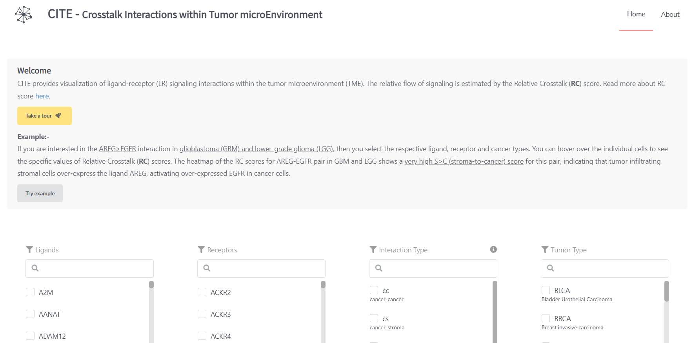
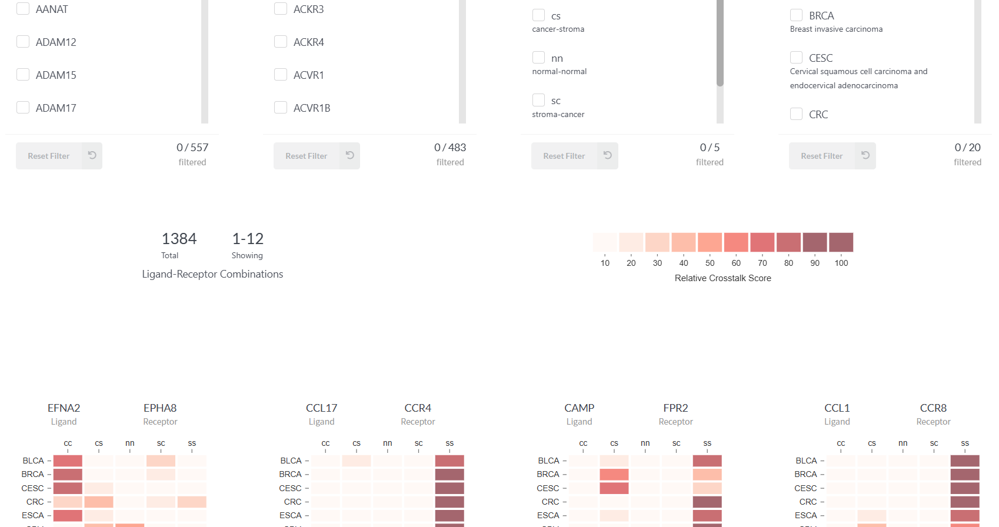
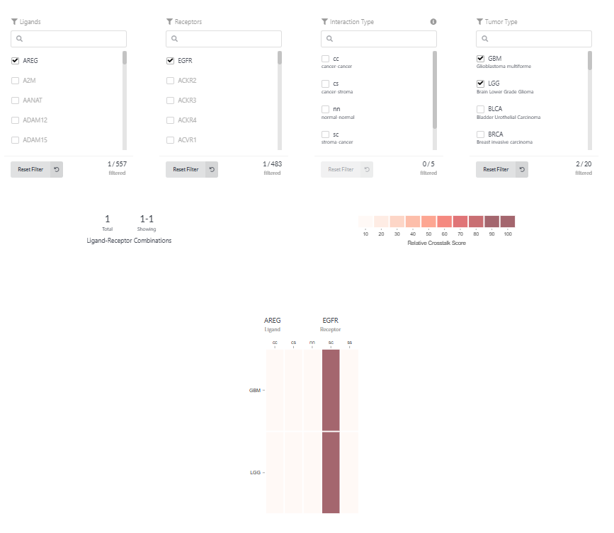

# CITE - Crosstalk Interactions within Tumor microEnvironment

> ⚠️ **Note:** CITE is now fully **offline**. Users must run it locally by following the instructions below.

---

## Overview

*CITE provides a database and dynamic visualization of ligand-receptor (LR) signaling interactions within the tumor microenvironment (TME).*

Crosstalk between ligands and receptors on cancer and stromal cells were estimated in the tumor microenvironment of 20 solid tumor types, based on cancer and stroma-specific expression.

The Relative Crosstalk (**RC**) score estimates the relative complex concentration given all four possible directions of signaling and a normal tissue state, e.g. for cancer-cancer (C>C) signaling.

To estimate the relative flow of signaling between cancer and stromal cell compartments, the RC score was used. Ligand-receptor complex activity was approximated using the product of ligand and receptor gene expression inferred for the given compartments (in linear scale). 

---

## Made with

[](https://shields.io/)  
[](https://shields.io/)

---

## Authors

- **Probhonjon Baruah** – [bigfoot31](https://github.com/bigfoot31)
- **Tanmay Kulshrestha** - [tanmay2893](https://github.com/tanmay2893)

---

## Repo Structure


-   data_preprocess: data processing code
    -   scripts: files to generate data files
-   client: frontend code written with React
-   server: backend code written with Flask

## Deployment (Local Only)

### requirements

-   data: files that contain expression and fold-change data
-   static: folder that contains all images including homepage help-image
-   Moesif Origin and CORS changer chrome extension: This is required for Cross origin resource sharing

### process

```bash
git clone https://github.com/bigfoot31/cite
cd cite
pip install server/requirments-dev.txt
python server/run.py
cd client
npm install  (# Only required for the first time)
npm run start
```

### Screenshots






### additional info

-   download fonts from https://google-webfonts-helper.herokuapp.com/fonts/noto-sans-sc?subsets=latin

## Acknowledgements

-   ASCII made with [Link](http://patorjk.com/software/taag/#p=testall&f=Graffiti&t=CITE)

If you use CITE in your work, please cite this paper:

Ghoshdastider et al., Data-driven inference of crosstalk in the tumor microenvironment, bioRxiv, 2020. (https://doi.org/10.1101/835512)

