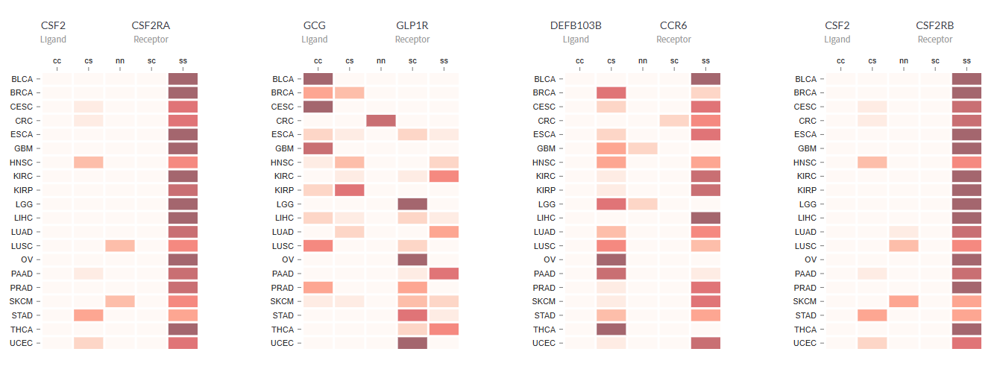

          /$$$$$$  /$$$$$$ /$$$$$$$$ /$$$$$$$$
        /$$__  $$|_  $$_/|__  $$__/| $$_____/
        | $$  \__/  | $$     | $$   | $$
        | $$        | $$     | $$   | $$$$$
        | $$        | $$     | $$   | $$__/
        | $$    $$  | $$     | $$   | $$
        |  $$$$$$/ /$$$$$$   | $$   | $$$$$$$$
        \______/ |______/   |__/   |________/

# CITE [](https://shields.io/) [](https://shields.io/)

This documentation is meant for CITE's offline usage.

## Authors

-   **Probhonjon Baruah** - [bigfoot31](https://github.com/bigfoot31)

## Repo structure

-   data_preprocess: data processing code
    -   scripts: files to generate data files
-   client: frontend code written with React
-   server: backend code written with Flask

## Deployment

### requirements

-   data: files that contain expression and fold-change data
-   static: folder that contains all images including homepage help-image
-   Moesif Origin and CORS changer chrome extension: This is required for Cross origin resource sharing

### process

```bash
git clone https://github.com/bigfoot31/cite
cd cite
pip install server/requirments-dev.txt
python server/run.py
cd client
npm install  (# Only required for the first time)
npm run start
```

### Screenshots





### additional info

-   download fonts from https://google-webfonts-helper.herokuapp.com/fonts/noto-sans-sc?subsets=latin

## Acknowledgements

-   ASCII made with [Link](http://patorjk.com/software/taag/#p=testall&f=Graffiti&t=CITE)
